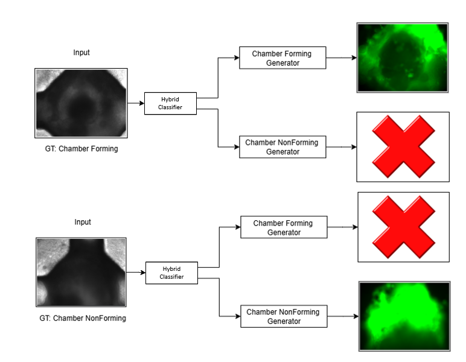

# Organoid Brightfield-to-Fluorescence Image Translation 🧫🔬

This project focuses on translating brightfield microscopy images of organoids (CH4 channel) into synthetic fluorescence images (CH1 channel) using deep learning techniques. The goal is to visualize cellular structures without the need for costly and time-consuming fluorescent staining.

## Project Overview
A dual-stage deep learning pipeline was developed:
1. **Organoid Classification**: Classifying organoids as **chamber-forming** or **non-forming**.
2. **Image Translation**: Generating synthetic fluorescence images (CH1-CH2) from brightfield inputs (CH4) using conditional image translation models.

Multiple architectures were benchmarked, with **Res-UNet** achieving the best performance for the image translation task.

## Dataset (Confidential)
- **Input Channel**: CH4 (Brightfield images)
- **Target Channel**: CH1 (Green Fluorescence images) CH2 (Red Fluorescence images)
- **Preprocessing**:
  - Resizing to 720x960 pixels
  - CLAHE (Contrast Limited Adaptive Histogram Equalization)
  - Data augmentation (rotation, flipping)

## Models
The following architectures were evaluated:
1. **ResNet50 + Vision Transformer (DeiT3-Base)** for classification (chamber-forming vs non-forming)
2. **U-Net** for image-to-image translation
3. **Res-UNet** (Residual U-Net) for image-to-image translation

The **Res-UNet** model achieved the highest fidelity in generating fluorescence images, outperforming the baseline U-Net in both PSNR and SSIM metrics.

## Results
| Model                     | PSNR   | SSIM   | Classification Accuracy |
|---------------------------|--------|--------|-------------------------|
| U-Net                     | 22.36  | 0.893  | N/A                     |
| **Res-UNet**               | **24.84** | **0.928** | N/A                     |
| ResNet50 + ViT (DeiT3-Base)| N/A    | N/A    | 95.23%                  |

The Res-UNet model demonstrated superior performance in generating high-fidelity fluorescence images, making it the selected architecture for deployment.

## Repository Structure

- The **/Classification/** folder contains training and validation scripts for the organoid classifier.
- The **/Unet/** folder includes training and validation workflows for the baseline U-Net model.
- The **/ResUnet/** folder contains the full pipeline, including training, validation, and testing.  
  - The **Test** scripts require manual specification of the trained model to use.
  - The **inference.py** script automates the end-to-end process: given a CH4 image, it performs classification and applies the correct Res-UNet generator to produce the synthetic CH1 image.

##  Complete Pipeline Overview

This diagram shows the entire process:
1. Input Brightfield Image (CH4)
2. Hybrid Classifier (ResNet50 + Vision Transformer) to determine organoid type
3. Selection of appropriate Res-UNet generator
4. Generation of synthetic Fluorescence Image (CH1-CH2)
